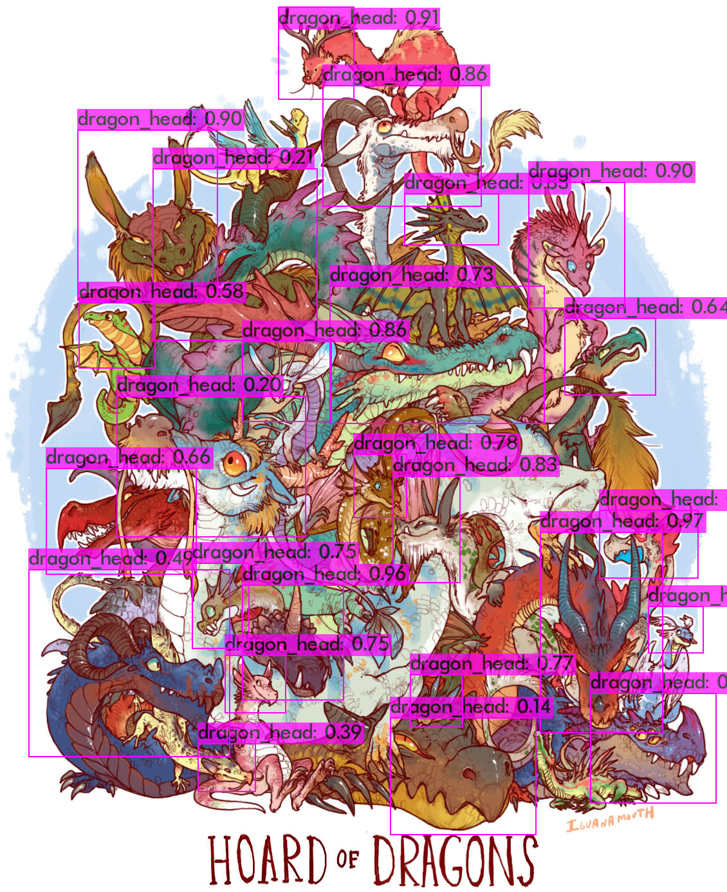

# Object detection with darknet YOLOv4
This repository contains:
- A containerized darknet framework with CUDA support. AlexeyAB's fork of darknet is used.
- Instructions for training and inference with YOLOv4 object recognition network.
- Instructions for configuring YOLOv4 for training on custom datasets *WIP*.
- The weights for example network which detects dragon heads in images can be found from [here](https://drive.google.com/drive/folders/1-_-UEogMCKSbjYAfzK1_F9Z7aDZLglhJ?usp=sharing).

